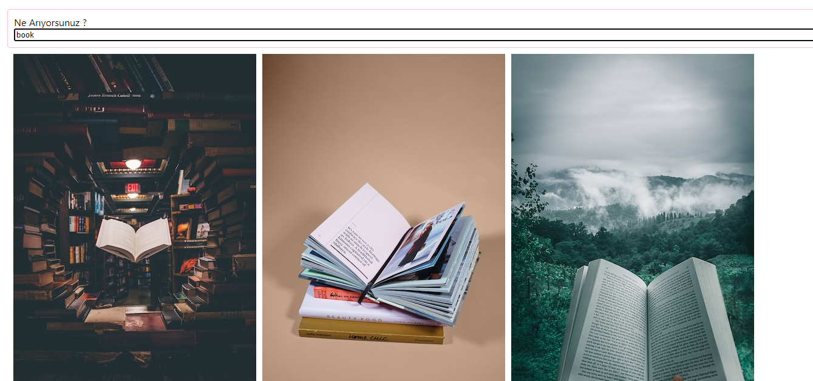

<table >
  <tr  >
    <th  >Title</th>
    <th >Desc</th>
  </tr>

<tr >
    <td >
       <h2>ApiProject</h2>
       
              

       
    </td>
    <td> 
With this project, I reinforced how to pull data from the backend with the Axios library. 
 
     <a href="https://github.com/nurullhkrds/react/tree/main/api" > click here </a>
    </td>

</tr>

 
</table>

