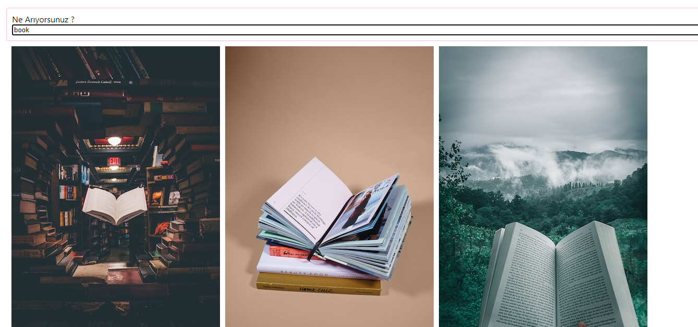
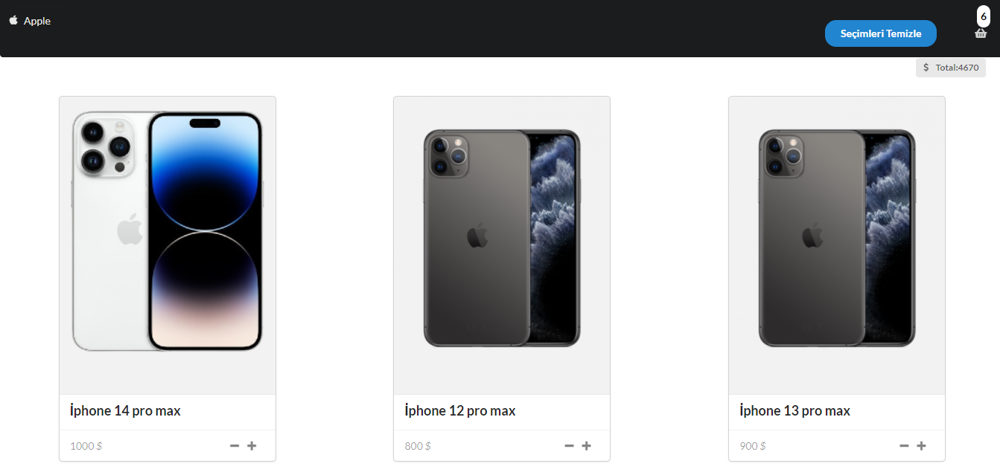
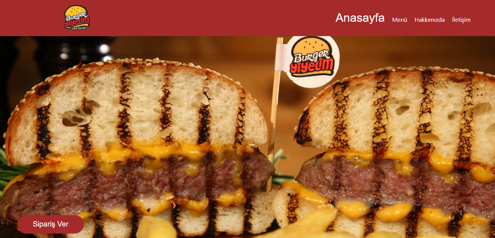
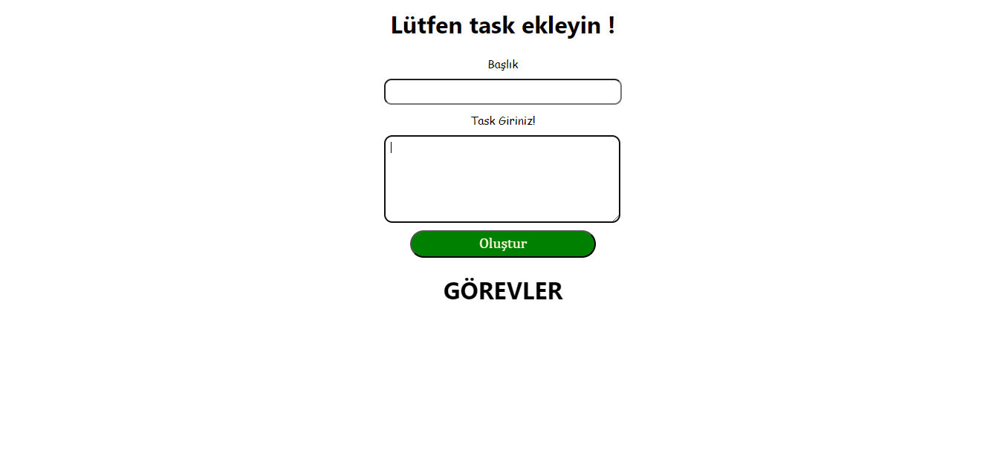
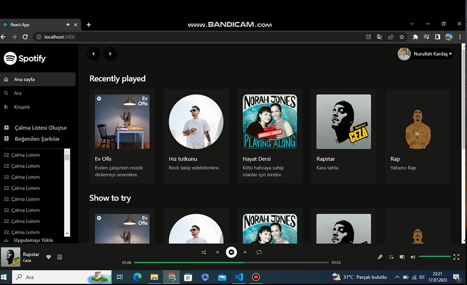

<table>
  <tr>
    <td>
      <h2>Memor-Games</h2>
      

        
      

    </td>
    <td>
      
The function and state management of the Redux-toolkit library was actively used and communication between other components was observed.

      <a href="https://github.com/nurullhkrds/react/tree/main/games-cardd"
        >click here
      </a>
    </td>
  </tr>

  <tr>
    <td>
      <h2>To Do Redux</h2>
      

        
      

    </td>
    <td>
      

        I added, deleted, updated and searched for assets using Redux-Toolkit.
      

      <a href="https://github.com/nurullhkrds/react/tree/main/todo-with-redux"
        >click here
      </a>
    </td>
  </tr>
   
  <tr>
    <td>
      <h2>E-Commerce Web</h2>
      

        
      

    </td>
    <td>
      

        Router and context api were actively used in the construction of the
        e-commerce site.
      

      <a
        href="https://github.com/nurullhkrds/react/tree/main/virtual-shop/client/virtual-shop"
        >click here
      </a>
    </td>
  </tr>
   

  <tr>
    <td>
      <h2>weather-app</h2>
      

        
      

    </td>
    <td>
      

        The project reflects the 8-day weather. It gives information about
        temperature, pressure, humidity and felt temperature.
      

      <a href="https://github.com/nurullhkrds/react/tree/main/weather-app"
        >click here
      </a>
    </td>
  </tr>
   

  <tr>
    <td>
      <h2>ToDo Project</h2>
      

        
      

    </td>
    <td>
      

        We can create a to-do list. We can mark the notes we have received and
        assign them to the done ones. We can then delete what has been done. All
        that remains is what is active, that is, what needs to be done.
      

      <a href="https://github.com/nurullhkrds/react/tree/main/my-app"
        >click here
      </a>
    </td>
  </tr>
   
  <tr>
    <th>Title</th>
    <th>Desc</th>
  </tr>

  <tr>
    <td>
      <h2>Api Project</h2>
      
    </td>
    <td>
      

        With this project, I reinforced how to pull data from the backend with
        the Axios library.
      

      <a href="https://github.com/nurullhkrds/react/tree/main/api"
        >click here
      </a>
    </td>
  </tr>
   
  <tr>
    <th>Title</th>
    <th>Desc</th>
  </tr>
  <tr>
    <td>
      <h2>Apple Project</h2>
      
    </td>
    <td>
      

        It was a project where I consolidated state management in the best way
        using the react-redux toolkit. I could see how powerful Redux is,
        especially when it comes to managing functions and variables with a
        single component.
      

      <a href="https://github.com/nurullhkrds/react/tree/main/apple"
        >click here
      </a>
    </td>
  </tr>
   
  <tr>
    <th>Title</th>
    <th>Desc</th>
  </tr>
  <tr>
    <td>
      <h2>Burger Project</h2>
      
    </td>
    <td>
      
I actively used the React-Router-Dom logic exactly in this project.

      <a href="https://github.com/nurullhkrds/react/tree/main/hamburger"
        >click here
      </a>
    </td>
  </tr>
   
  <tr>
    <th>Title</th>
    <th>Desc</th>
  </tr>
  <tr>
    <td>
      <h2>ToDoList Project</h2>
      
    </td>
    <td>
      

        With this project, I reinforced how to pull data from the backend with
        the Axios library. In addition, I actively implemented props
        communication between components for adding, deleting and updating
        operations.
      

      <a href="https://github.com/nurullhkrds/react/tree/main/contextApi"
        >click here
      </a>
    </td>
  </tr>
   
  <tr>
    <th>Title</th>
    <th>Desc</th>
  </tr>
  <tr>
    <td>
      <h2>SpotifyClone Project</h2>
      
    </td>
    <td>
      

        I would like to share the spotify clone project I made with React and
        Tailwind Css technologies. By actively using components-props
        transitions and react-hooks in the project, a lot about the relationship
        between hooks and components It was a project I was practicing. I
        implemented state management using redux-toolkit and transitioned
        between react-router and components. I got help from music functions
        with useAudio, useFullScren and React-range components in React use.
      

      <a href="https://github.com/nurullhkrds/react/tree/main/spotifyclone"
        >click here
      </a>
    </td>
  </tr>
</table>

